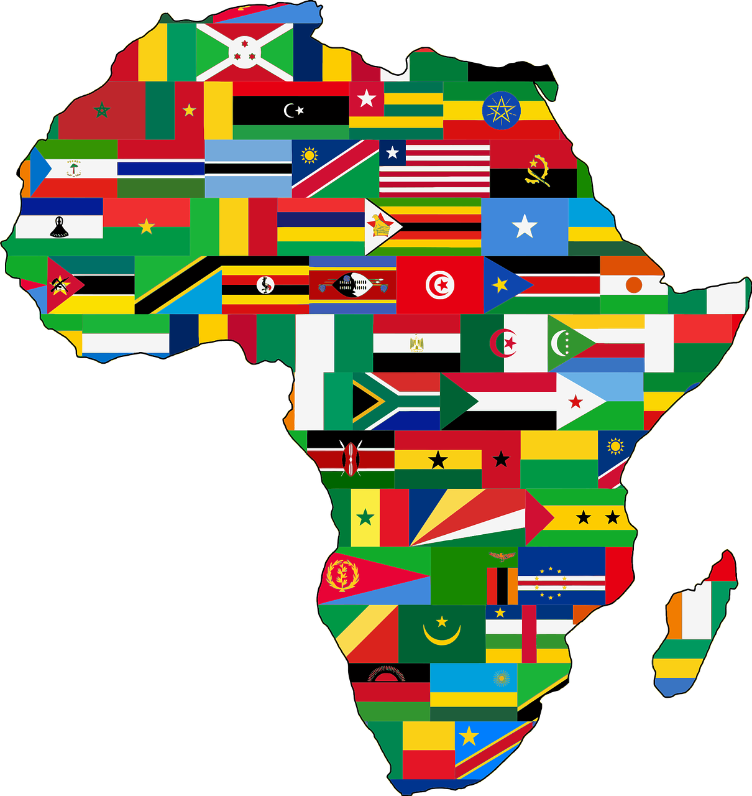

<!-- Image by <a href="https://pixabay.com/users/openclipart-vectors-30363/?utm_source=link-attribution&utm_medium=referral&utm_campaign=image&utm_content=161697">OpenClipart-Vectors</a> from <a href="https://pixabay.com//?utm_source=link-attribution&utm_medium=referral&utm_campaign=image&utm_content=161697">Pixabay</a>

Image by OpenClipart-Vectors from Pixabay -->

# African Open Source Community

[Image source](https://pixabay.com/users/openclipart-vectors-30363/?utm_source=link-attribution&utm_medium=referral&utm_campaign=image&utm_content=161697)

This project contains a curated list of all open source projects created by Africans.

To make your first contribution, visit [CONTRIBUTING.md](https://github.com/DrVickie8/African-Open-Source-Community/blob/main/CONTRIBUTING.md) to and [CODE_OF_CONDUCT.md](https://github.com/DrVickie8/African-Open-Source-Community/blob/main/CODE_OF_CONDUCT.md)
